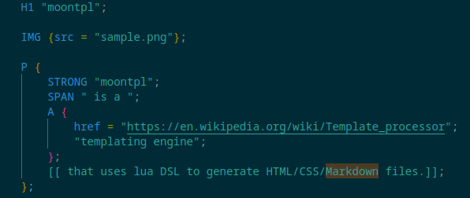

# moontpl



**moontpl** is a [templating engine](https://en.wikipedia.org/wiki/Template_processor) that uses lua DSL to generate HTML/CSS/Markdown files.

-----------------

## Why

Long-story-short, I like lua's "*everything is tables* syntax and philosophy. I personally find it tedious to write HTML by hand, and find it even more laborious to read. HTML is also just a markup language, so it's almost always used as a compilation target for anything beyond the simple use cases.

This is where lua and my weird DSL comes in. Lua uses a uniform syntax for arrays and dictionaries. This allows me to express tree-based structures more expressively, and in particular, write HTML code more succintly.

In short, I like using lua as a DSL and I hate reading/writing HTML code directly. 

-----------------

## Getting Started

There are several ways of using moontpl:

-  Static site generator 
-  SSG with Golang extensions 
-  Templating engine

### As a Static Site Generator

#### 1. Installation

First, install the [go toolchain](https://go.dev/doc/install) if you haven't already. Then run the following command to install to compile and install the binary.

```bash
$ go install github.com/nvlled/moontpl/cmd/moontpl@latest
```

If everything went well, then the command moontpl should be available.

Running `moontpl` without any arguments should show the help file:

```bash
  Usage: moontpl [--luadir LUADIR] [--runtag RUNTAG] [--version] <command> [<args>]
  
  Options:
    --luadir LUADIR, -l LUADIR
                           directories where to find lua files with require(), automatically includes SITEDIR
    --runtag RUNTAG, -t RUNTAG
                           runtime tags to include in the lua environment
    --version, -v          show version number
    --help, -h             display this help and exit
  
  Commands:
    build
    run
    serve
    luadoc
```

#### 2. Create a simple site from scratch

```bash
# Create site directory
mkdir -p mysite

# Create a lua page file
cat << EOF > mysite/index.html.lua
require("web")
return DIV { "hello, world" }
EOF

# Run file and show output
moontpl run mysite/index.html.lua
# outputs <div>hello, world</div>

# Builds the site into the output/ directory.
# All .html.lua are rendered into .html
# all other files are copied into the output.
moontpl build mysite/ output/

# Open local web server at http://localhost:9876,
# only use for local development, not for production use (yet).
moontpl serve mysite
```

You can find more examples in the examples repository

-----------------

### As Static site generator with golang extensions

*TODO*

### As a Templating Engine

*TODO*
